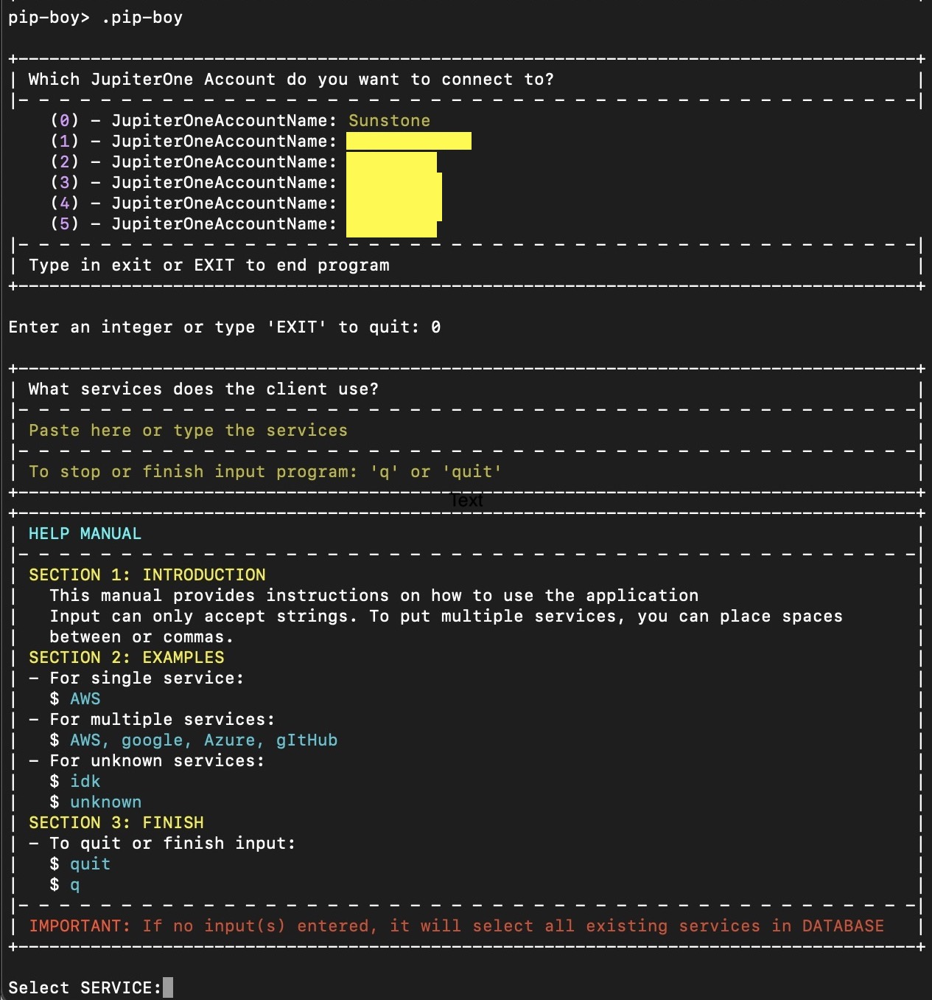

# JupiterOnePipBoy
A github page for those who want to master, understand, and connect with JupiterOne community. Based on JupiterOneGuide (PRIVATE).

## Overview
JupiterOnePipBoy utilizes GraphQL for its public API, the same technology we rely on internally to develop our applications. This ensures robustness and scalability, facilitating efficient interactions with our data.

This repository includes the complete source code necessary for running the JupiterOnePipBoy application. Alongside the primary code, you will find various scripts intended for testing purposes. Most documentation and additional test scripts are maintained separately to keep the core repository streamlined.

## Version Control
The source code for JupiterOnePipBoy is managed using Git. If you are accessing this repository via GitHub or another Git-based service, please note that you are interacting with a mirror of the main repository.

Each commit in the repository is uniquely identified. Refer to the `commit.uuid` file located at the root of the project for the official commit names. Always use these official names when discussing changes or issues related to specific commits.

## Verifying Code Authenticity
For users who obtain their copy of JupiterOnePipBoy from secondary sources, we provide detailed instructions on how to verify the integrity of the source code. Please see the **Verifying Code Authenticity** section for guidance.

## Contacting the Developers
We encourage open communication regarding JupiterOnePipBoy and welcome any inquiries or bug reports via our dedicated forum at URL HERE. Anonymous posts are allowed to ensure privacy and ease of access.

For security-sensitive issues, please contact the development team directly at our secure email address: EMAIL.

### Help Commands
  
This image likely displays a list of help commands available in the software or application, providing users guidance on how to use various features.

### Commands Examples Outputs
  
This image probably shows examples of commands along with their outputs, demonstrating how to execute specific tasks in the application and what results to expect.

### Pip-Boy Command Example
  
This image seems to illustrate an example of using the Pip-Boy command, possibly within a gaming context or a specialized software interface.

### Services Input
  
This image might display the interface or prompt where users input data related to services, showing how to configure or specify service-related settings or options.

## License
JupiterOnePipBoy is released under the MIT license. This choice supports open development and distribution while ensuring that contributions remain free for commercial or private use. See [https://samuel](https://samuelroiz.github.io/index.html) for license details.

Please note that while we accept contributions, we require that all contributors agree to release their submissions under the same MIT license to maintain the project's licensing integrity.
